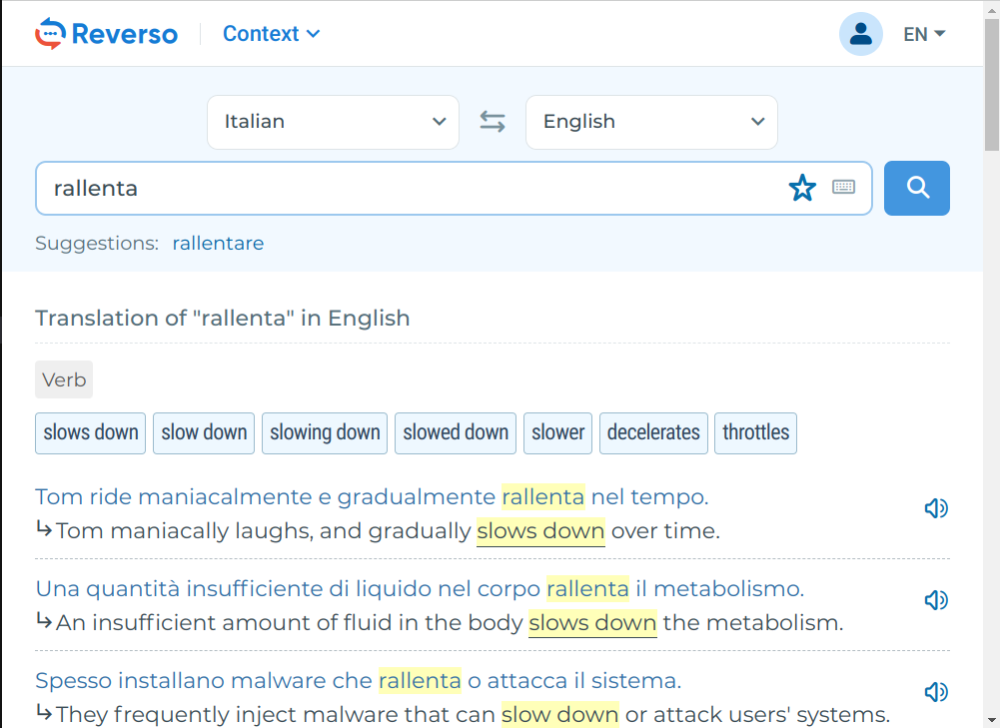
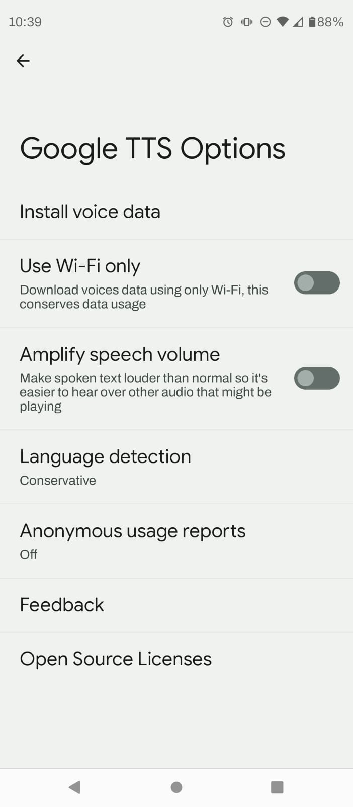
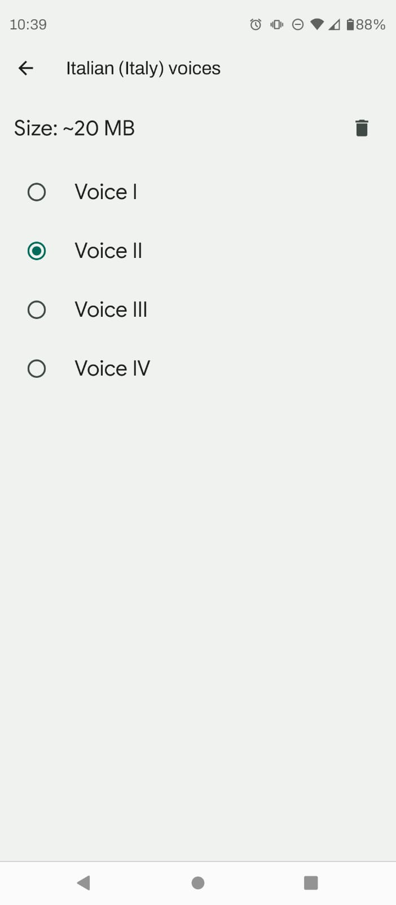
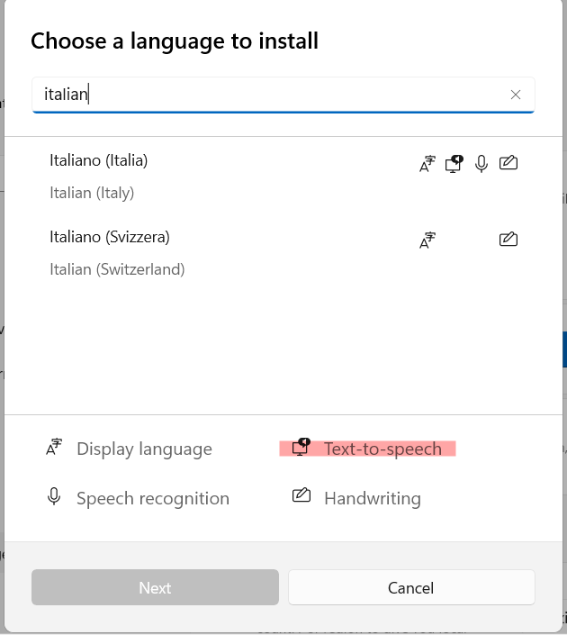
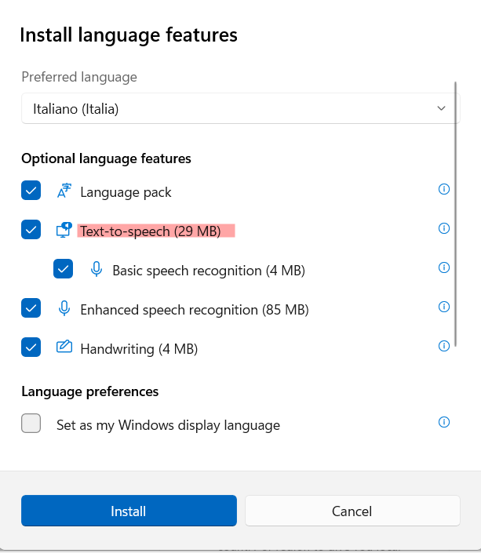

# Installation

The most reliable way of installing a template on Anki is by importing a deck with cards created using the template. To do that, we're going to run a Google Colab script that will generate the deck for us. Please click this [link](https://colab.research.google.com/github/viniciusdutra314/Anki-CardMaker/blob/main/AnkiCardMaker.ipynb#scrollTo=4PlW-rYmGAWG) and follow the instructions.

# Main features

- **Cross-platform**: All the magic is done with Anki templates, which is a native feature for Anki on Windows/Mac/Linux, on mobile versions of Android/iOS, and even on your browser on [AnkiWeb](https://ankiweb.net/).

- **Generate multiple card types at once**: Create one note and generate up to *3* different cards! Flashcards for passive/active vocabulary and writing skills with automatic correction.

- **On-the-fly audios**: Audios are generated dynamically, without the need for storing hundreds of megabytes of audios and support for different voices, accents, and speeds (~1 kilobyte per note).

- **Dictionary Search**: Words/phrases can be studied in more depth inside the cards themselves! With just one click on 🔎, a quick search on a custom dictionary will be made (examples: Reverso, Cambridge Dictionary).

# Voices and audio generation:

As explained in the [Main Features](#main-features) section, the audios are generated locally using the TTS (Text-To-Speech) of your device. You **need to have installed the TTS of the language that you will generate audios for**.

The next subsections will be a quick tutorial on how to install TTS for an arbitrary language on Android, Windows, and Linux. The same ideas apply to Mac/iOS.

### Android:

The following tutorial was made on version 12 of Android but should apply to other versions.

Go to **Settings/Text-to-speech output**, where you should find two sliders:
- Speech rate: Adjust the velocity of the voice (you can begin slowly and then accelerate as you progress in the language).
- Pitch: Adjust the pitch (if the voice doesn't please you, maybe you should try changing).

  
   
  

Depending on the preferred engine selected, the options can be a little bit different, but you should install the desired voice (the accent that you choose should be the same as your template).

### Windows:

The tutorial was made using Windows 11, but it should probably be the same for Windows 10. You need to install a new language in the language section of Windows, and on language features, at least activate the text-to-speech feature.

  
   

### Linux:

Unfortunately, Linux doesn't come with TTS by default like the other operating systems. One easy solution is to install the Anki add-on [AwesomeTTS](https://ankiweb.net/shared/info/1436550454). It will generate audios using online services like Google Translate. You need to create a preset selecting a service/voice for your target language, and that's it.

The audios will continue to be generated on the fly, and the voices on your other devices will remain the same. The only issue is that **you need a WiFi connection** to display the cards on Linux.