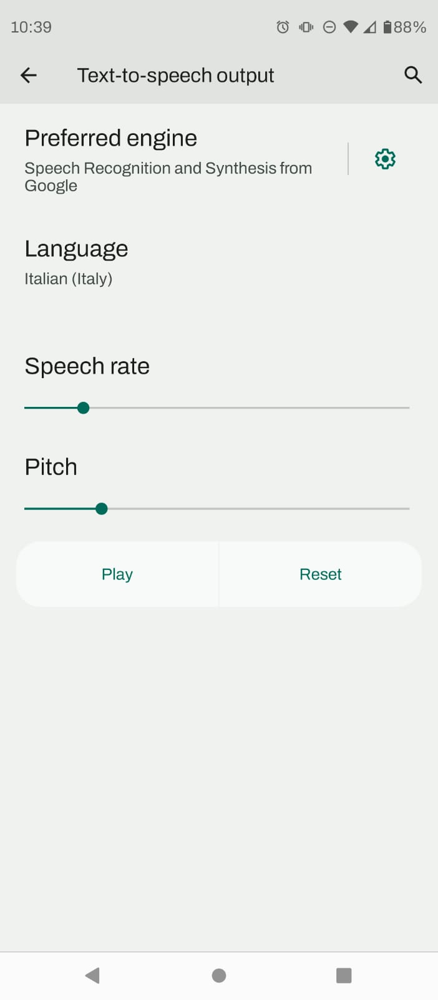
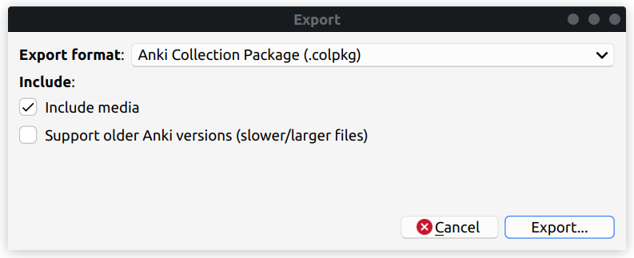
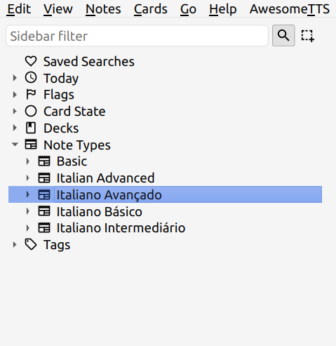
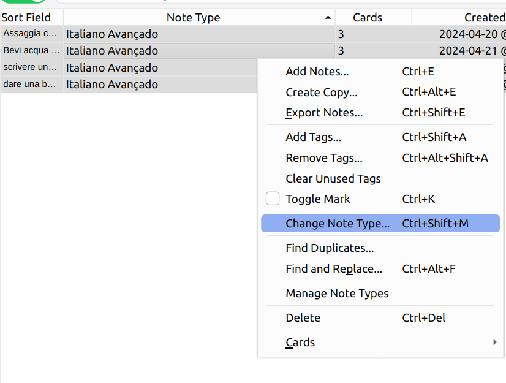
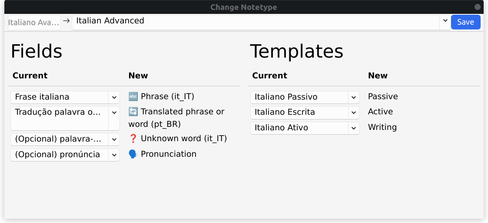

Anki-CardMaker is an Anki template generator that will boost your language learning!

I'm fascinated by learning languages, but I always thought that the process of creating cards was **tedious**. I never found a solution that is automatic enough to be practical yet not too automatic, which often leads to unreliable cards when using tools similar to Google Translate or ChatGPT.

So, using my programming skills as a computational physics undergraduate, I could find a solution that:

- **Generates multiple card types at once**: It creates one note and generates up to *3* different cards! Flashcards for passive/active vocabulary and writing skills with automatic correction.

- **Cross-platform**: All the magic is done with Anki templates, which are a native feature for Anki on Windows/Mac/Linux, on mobile versions of Android/iOS, and even on your browser on [AnkiWeb](https://ankiweb.net/)

#### Quick summary
- [How to use it](#how-to-use-it)
- [Installation](#installation)
- [Voices and accents](#voices-and-accents)
- [Migrate notes to a new template](#migrate-notes-to-a-new-template)

## How to Use It

There are 4 fields that can be filled, but only two of them are mandatory. Let's see how they work with a concrete example in Italian:

- 🔤 **Phrase**: (Io sono un ragazzo)  
  The phrase that you're studying.

- 🔄 **Translated phrase or word (young man)**  
  If you have a specific word to study, put the translation here. If you're studying the whole phrase, put the entire translation of the phrase.

- ❓ **Unknown word (optional) (Ragazzo)**  
  If the goal of the note is to learn a specific word, insert the unknown word here.

- 🗣️ **Pronunciation (optional) (/ra'ɡatːso/)**  
  If you like to use the International Phonetic Alphabet (IPA) or some type of memorization technique, fill this field.

**Dictionary Search**: Words/phrases can be studied in more depth inside the cards themselves! With just one click on 🔎, a quick search on a custom dictionary will be made (examples: Reverso, Cambridge Dictionary).

### Passive Card

**Ragazzo -> Young Man**

**Front**: Just the phrase, If there's an unknown word, it will be highlighted with your selected color.

<audio controls>
  <source src="audios/Io sono un ragazzo.mp3" type="audio/mpeg">
</audio>

**Front + Back**: The translation of the word/phrase with pronunciation.

<audio controls>
  <source src="audios/Ragazzo.mp3" type="audio/mpeg">
</audio>

### Active Card

**Young Man -> Ragazzo**

The active card is the exact opposite of the passive card. It will ask you to say "young man" in Italian. The reverse order can be very tricky but also extremely important for speaking the language fluently.

**Front**:

**Front + Back**:

### Writing

**Type Young Man**

An audio of the phrase will play. If you have an unknown word, a separate audio will also play.

You should type the phrase or the word, depending on what you want to learn. An automatic checker will compare what you type with the correct spelling.

- *Typing the whole phrase*
  

- *Typing just the unknown word*
  

### Word Matching
One interesting feature is that if you accidentally commit a typo while typing an unknown word/phrase, the template has a little JavaScript code to check if the two fields are compatible. If not, it will insert an error message on the card. Then you can edit and type correctly.

### Image Support

Sometimes the meaning of a word/phrase is hard to put into words, but it's easily conveyed using images. This template also supports images in the 🔄 Translated phrase or word field.

# Installation

The most reliable way of installing a template on Anki is by importing a deck with cards created using the template. To do that, we're going to run a Google Colab script that will generate the deck for us. Please click this [link](https://colab.research.google.com/github/viniciusdutra314/Anki-CardMaker/blob/main/AnkiCardMaker.ipynb#scrollTo=4PlW-rYmGAWG) and follow the instructions.

An Anki deck called "Anki-CardMaker (test the audio)" will be imported with cards to test if the voices are working as they should. Now, you have imported the template to your Anki. To use it, go to Add and in the upper-left corner, find your template under Type.

# Voices and accents:

**On-the-fly audios**: Audios are generated dynamically, without the need for storing hundreds of megabytes of audios and support for different voices, accents, and speeds (~1 kilobyte per note).
The audios are generated locally using the TTS (Text-To-Speech) of your device, so you **need to have installed the TTS of the language that you will generate audios for**.

The next subsections will be a quick tutorial on how to install TTS for an arbitrary language on Android, Windows, and Linux. The same ideas apply to Mac/iOS.

### Android:

The following tutorial was made on version 12 of Android but should apply to other versions.

Go to **Settings/Text-to-speech output**, where you should find two sliders:
- Speech rate: Adjust the velocity of the voice (you can begin slowly and then accelerate as you progress in the language).
- Pitch: Adjust the pitch (if the voice doesn't please you, maybe you should try changing).

  
   
  

Depending on the preferred engine selected, the options can be a little bit different, but you should install the desired voice (the accent that you choose should be the same as your template).

### Windows:

The tutorial was made using Windows 11, but it should probably be the same for Windows 10. You need to install a new language in the language section of Windows, and on language features, at least activate the text-to-speech feature.

  
   

### Linux:

Unfortunately, Linux doesn't come with TTS by default like the other operating systems. One easy solution is to install the Anki add-on [AwesomeTTS](https://ankiweb.net/shared/info/1436550454). It will generate audios using online services like Google Translate. You need to create a preset selecting a service/voice for your target language, and that's it.

The audios will continue to be generated on the fly, and the voices on your other devices will remain the same. The only issue is that **you need a WiFi connection** to display the cards on Linux.

## Migrate notes to a new template

Maybe you want to change the accent that you're learning, or the highlight color doesn't have great contrast with the background, or a new version of the template was released, and you want to update.

#### Manual backup
Before messing around with templates and notes, I highly recommend making a full backup of your Anki decks. You can go to Files/Export, select all the decks using the format .colpkg, and save them to a safe place.

Manual backup is always recommended because **Anki has the right to delete your AnkiWeb account after 6 months of inactivity**. If you want to know more, please follow this [link](https://faqs.ankiweb.net/ankiweb-account-removal.html).

#### Changing note type
Go to **Browser**, and in the left corner, you will find your notes separated by note types. Select the note type (template) that you want to change.

Select all notes by pressing *Ctrl + A*, and then click *Change Note Type*.

At the top of the widget, select the new template. As you can see, the *current* template is an old one with fields in Portuguese, from when I was learning how to create templates. Make sure that all fields will be passed correctly, and then press save. It's recommended that your current and new fields have the same number of card types.

